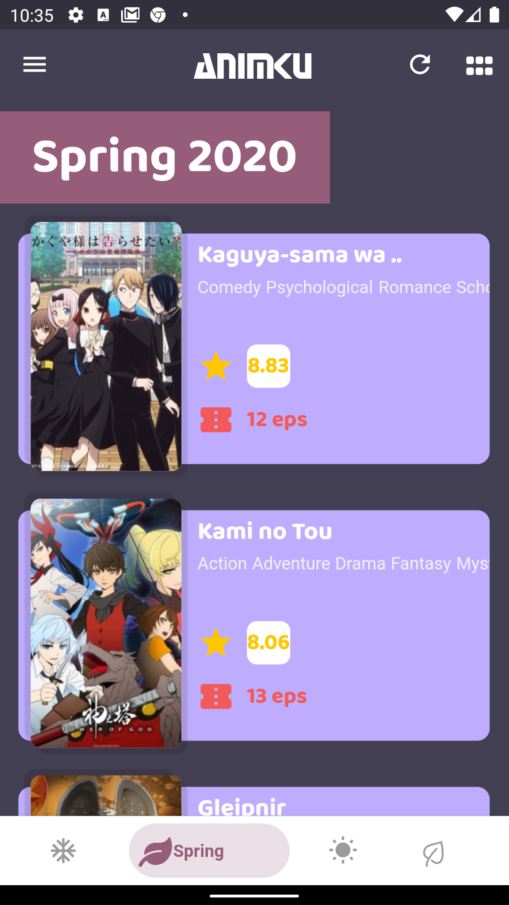
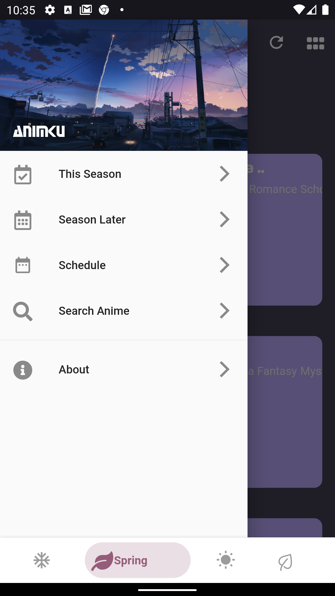
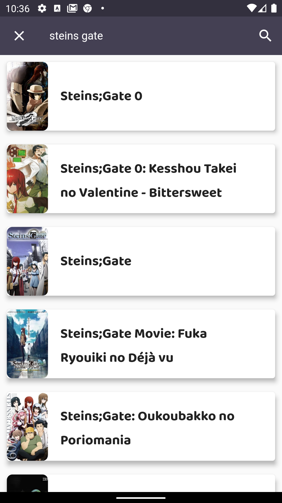
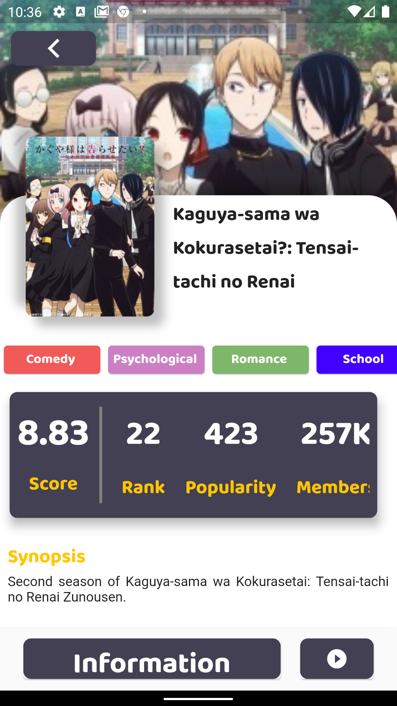

# ANIMKU - Discover your favourite anime

Animku is unofficial [myanimelist.net](https://myanimelist.net) application that will be available on ios and android.

if you want to contribute on this project, you can fork this project and pull request.


## Features

- [x] season schedule
- [x] anime detail
- [x] anime schedule (sunday - saturday)
- [x] canceled anime (season later)
- [x] search anime by name

## Download Apk
> [animku.apk](https://github.com/febryardiansyah/animku/releases/tag/0.1)

## Download IOS
> _Coming soon_

## ScreenShoot
 
 


## Build Setup
``` bash

# install dependencies
$ flutter pub get

# run debug mode
$ flutter run

# run release mode
$ flutter run --release

# build app bundle
$ flutter build appbundle

# build apk
$ flutter build apk

```

## Special Thanks
Thanks to JikanApi Team that has been provided myanimlist.net api for public
You can read the docs [here](https://jikan.docs.apiary.io/)


For detailed explanation on how things work, check out [Flutter docs](https://flutter.dev/docs).
